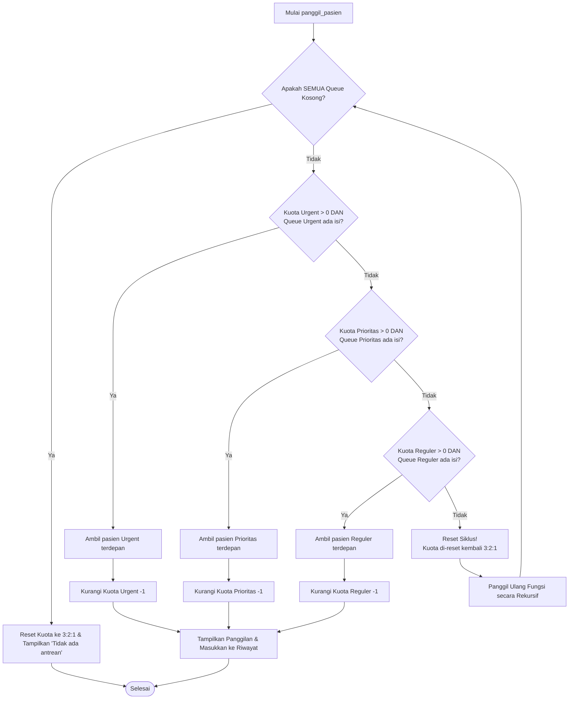
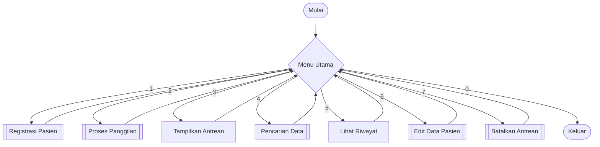
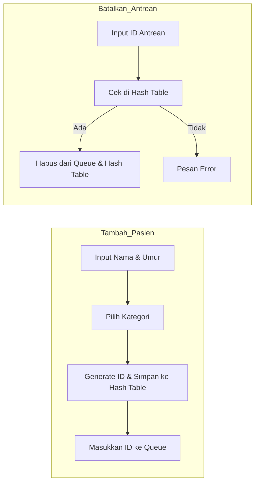
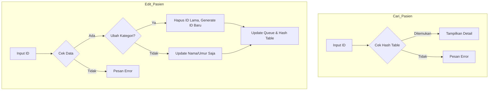
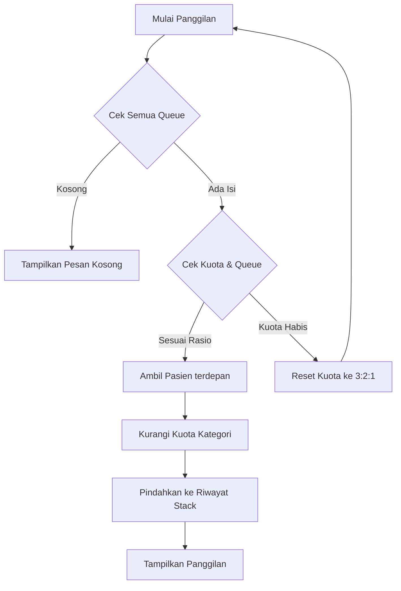

# 🏥 Sistem Antrean Rumah Sakit (Queue System)

Sistem ini adalah aplikasi manajemen antrean rumah sakit berbasis Python yang mengimplementasikan berbagai struktur data fundamental dan algoritma penjadwalan. Aplikasi ini dirancang untuk mengelola pasien berdasarkan tingkat urgensi menggunakan metode **Weighted Round Robin**.

oleh:
1. Azis Khoirul Setiawan (43050250004)
2. Miftakhul Anwar (43050250010)
3. Muhammad Fathir Al Faruq (43050250011)

## 🚀 Fitur Utama

1.  **Multi-Queue Management**: Memisahkan antrean menjadi tiga kategori: Urgent, Prioritas, dan Reguler.
2.  **Weighted Round Robin (3:2:1)**: Algoritma pemanggilan otomatis yang memberikan prioritas lebih tinggi kepada pasien Urgent dan Prioritas.
3.  **CRUD Operasi**:
    *   **Create**: Menambah pasien baru dengan ID otomatis.
    *   **Read**: Mencari data pasien dan melihat daftar antrean.
    *   **Update**: Mengubah data pasien termasuk perpindahan kategori antrean.
    *   **Delete**: Membatalkan antrean pasien.
4.  **Riwayat Panggilan**: Mencatat pasien yang telah dipanggil menggunakan konsep LIFO (Stack).

## 🛠️ Struktur Data yang Digunakan

*   **Queue (FIFO)**: Digunakan untuk mengelola barisan antrean pasien di setiap kategori (`queue_urgent`, `queue_prioritas`, `queue_reguler`).
*   **Hash Table (Dictionary)**: Digunakan untuk `database_pasien`, memungkinkan pencarian data pasien secara instan (O(1)) berdasarkan ID.
*   **Stack (LIFO)**: Digunakan untuk `riwayat_panggilan`, menampilkan pasien yang terakhir dipanggil di posisi paling atas.

## ⚙️ Algoritma Pemanggilan (Weighted Round Robin)

Sistem menggunakan rasio **3:2:1** untuk memastikan keadilan bagi semua kategori namun tetap memprioritaskan yang kritis:
*   **Urgent**: 3 Pasien
*   **Prioritas**: 2 Pasien
*   **Reguler**: 1 Pasien

Siklus akan berulang setelah kuota terpenuhi atau jika antrean tertentu kosong.

### Detail Flowchart Algoritma Panggilan



## 📊 Flowchart Sistem

Untuk memudahkan pemahaman, flowchart sistem dibagi menjadi beberapa bagian utama:

### 1. Alur Menu Utama
Menunjukkan navigasi utama dalam aplikasi.



### 2. Alur Manajemen Pasien (Tambah & Batalkan)
Detail proses pendaftaran pasien baru dan pembatalan antrean.



### 3. Alur Operasi Data (Cari & Edit)
Detail proses pencarian dan pembaruan data pasien.



### 4. Alur Panggilan (Weighted Round Robin)
Proses pemanggilan pasien berdasarkan prioritas rasio 3:2:1.



## 💻 Cara Menjalankan

1.  Pastikan Anda memiliki Python 3.x terinstal.
2.  Jalankan file `main.py` melalui terminal:
    ```bash
    python main.py
    ```

## 📝 Contoh ID Antrean
*   **U-001**: Kategori Urgent
*   **P-002**: Kategori Prioritas
*   **R-003**: Kategori Reguler
